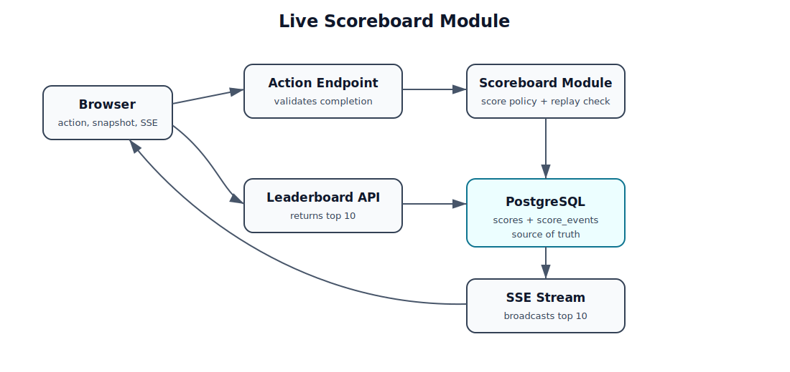
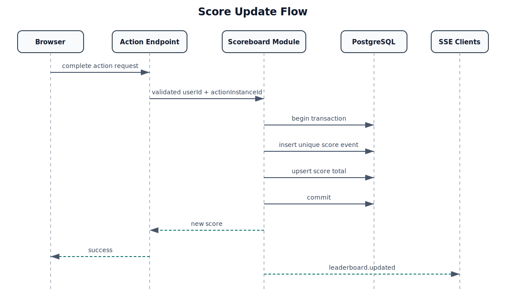

# Problem 6 – Live Scoreboard Module

This is a backend specification for a live top-10 scoreboard. It is written as an implementation handoff, not as working application code.

The system needs to:

- show the current top 10 scores;
- update the scoreboard live when scores change;
- increase a user's score after a completed action; and
- prevent users from increasing scores without authorization.

## Assumptions

- The exact action is outside this module. It could be a game win, quiz completion, check-in, or something else.
- The client is not trusted to decide whether an action is valid.
- The client is also not trusted to send a score amount.
- The backend has an action-completion endpoint that validates the action first, then calls the scoreboard module internally.

## Architecture



The first version can live inside one backend application:

- an auth middleware validates the user's access token before action completion;
- an action endpoint validates that the user really completed the action;
- a scoreboard module records score changes;
- PostgreSQL stores scores and action history;
- Redis caches the current top 10 leaderboard snapshot;
- a leaderboard endpoint returns the current top 10; and
- an SSE endpoint pushes live leaderboard updates.

PostgreSQL remains the source of truth. Redis is a derived cache for the public top-10 list because every user reads the same leaderboard until a score update changes it.

## Data model

### `scores`

Stores the current score per user.

| Column | Type | Notes |
|---|---|---|
| `user_id` | UUID | Primary key |
| `score` | INTEGER | Current score, never negative |
| `updated_at` | TIMESTAMPTZ | Last update time |

Recommended index:

```sql
CREATE INDEX scores_top_10_idx ON scores (score DESC, user_id ASC);
```

### `score_events`

Stores every accepted score change. This gives an audit trail and makes debugging possible.

| Column | Type | Notes |
|---|---|---|
| `id` | UUID | Primary key |
| `user_id` | UUID | User receiving points |
| `action_type` | TEXT | Example: `daily_login`, `level_complete` |
| `action_instance_id` | UUID | Unique ID for this completed action |
| `delta` | INTEGER | Score amount derived by the server |
| `created_at` | TIMESTAMPTZ | Creation time |

Required constraint:

```sql
CREATE UNIQUE INDEX score_events_action_once_idx
ON score_events (user_id, action_instance_id);
```

This is the main replay protection. If the same completed action is submitted twice, the second insert fails and the score is not incremented again.

## Auth module

The auth module is responsible for identifying the user before any action can award points.

Recommended first version:

- Browser sends a JWT access token in `Authorization: Bearer <token>`.
- Auth middleware verifies token signature, issuer, audience, expiry, and required scopes.
- Middleware stores `userId` and scopes in the request context.
- Action-completion handlers use the authenticated `userId`; they do not accept `userId` from the browser body.
- Internal score update calls are protected separately with service-to-service credentials or by keeping the module in-process.

Example request context after auth:

```ts
{
  userId: "4c996760-91d1-4f15-80e6-1191d68fdb8f",
  scopes: ["action:complete"]
}
```

This keeps authorization close to the HTTP boundary and avoids trusting client-supplied identity.

## API

### Internal score update

`POST /internal/score-events`

This endpoint is called by backend code after the action has already been validated. It should not be exposed as a public client endpoint.

Request:

```json
{
  "userId": "4c996760-91d1-4f15-80e6-1191d68fdb8f",
  "actionType": "level_complete",
  "actionInstanceId": "748abc0b-b612-46f4-8200-c579b02d18d7"
}
```

Rules:

- The caller must be trusted backend code.
- `actionType` must exist in server-side configuration.
- The server derives `delta`; the request cannot include a score amount.
- `actionInstanceId` must be unique for that user.

Success:

```json
{
  "userId": "4c996760-91d1-4f15-80e6-1191d68fdb8f",
  "score": 120,
  "delta": 10
}
```

Errors:

- `400` for invalid request shape;
- `403` if the caller is not allowed to write scores;
- `409` if the action instance was already recorded; and
- `422` for an unknown action type.

### Leaderboard snapshot

`GET /api/leaderboard`

Public endpoint. Returns the current top 10.

```json
{
  "entries": [
    { "rank": 1, "userId": "u1", "score": 920 },
    { "rank": 2, "userId": "u2", "score": 870 }
  ]
}
```

Ordering:

1. score descending;
2. `user_id` ascending to keep ties deterministic.

Read behavior:

1. Try `leaderboard:top10` from Redis.
2. If cache exists, return it.
3. If cache is missing, query PostgreSQL, write the Redis cache, then return the result.
4. After every accepted score update, refresh the Redis top-10 cache before broadcasting.

Use a short TTL as a safety net, for example 30–60 seconds, but rely mainly on explicit cache refresh after writes.

### Live leaderboard stream

`GET /api/leaderboard/live`

Uses Server-Sent Events because updates only need to flow from server to browser.

On connection, send a full snapshot:

```text
event: snapshot
data: {"entries":[...]}
```

After a successful score update, send:

```text
event: leaderboard.updated
data: {"entries":[...]}
```

The server should also send a heartbeat every 15–30 seconds and remove the connection from its client list when the request closes.

## Execution flow



1. User completes an action in the product.
2. Browser calls the normal action-completion endpoint.
3. Backend validates the user's JWT and checks whether the action is really complete.
4. Backend creates or receives an `actionInstanceId` for this completion.
5. Backend calls the scoreboard module internally.
6. Scoreboard module checks the action type and derives the score delta.
7. Scoreboard module opens a transaction:
   - insert into `score_events`;
   - upsert into `scores` and add the delta.
8. If the insert conflicts on `(user_id, action_instance_id)`, roll back and return `409`.
9. Commit the transaction.
10. Rebuild the top-10 leaderboard from PostgreSQL and update Redis.
11. Broadcast the cached top-10 snapshot to SSE clients.

## Security notes

- Do not expose score increment as a public API.
- Do not accept `delta` from the client.
- Do not accept `userId` from the client for score writes; derive it from verified auth context.
- Keep score policy on the server.
- Use a unique `actionInstanceId` for every completed action.
- Enforce replay protection with a database unique constraint.
- Rate-limit action completion endpoints by user and IP.
- Log rejected score attempts, duplicate action instances, and unusually fast score growth.

## Improvements worth considering

### Action-specific replay windows

Some actions should be one-time only. Others should be repeatable, such as one login reward per day. Store the replay window in action configuration and include the period in the unique key when needed.

### Event IDs for SSE reconnects

The simple version sends a fresh snapshot when the browser reconnects. If exact replay becomes important, add a monotonically increasing event ID and use `Last-Event-ID`.

### Cache invalidation

The top-10 cache should be refreshed only after the database transaction commits. If Redis is temporarily unavailable, the API can fall back to PostgreSQL and log the cache failure. The cache must never become the source of truth.

### Admin reversal

If a score needs to be corrected, add a negative score event rather than editing old history. This keeps the audit trail intact.
